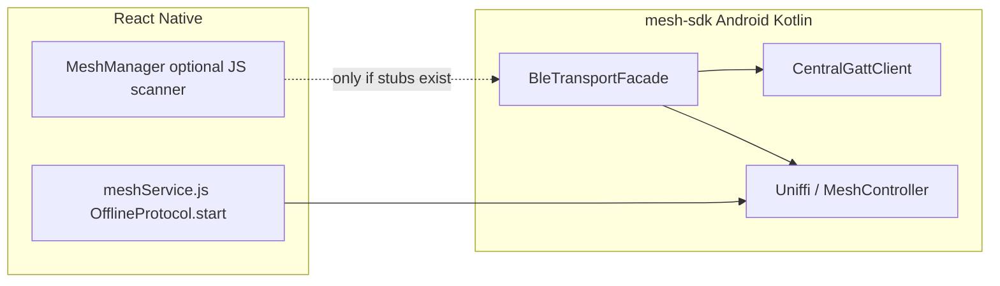

# BLE mesh transport: phased native fixes

## Architecture (today)

- Real devices use **`capabilities.sdkOwnsBleTransport`** ([`Capabilities.js`](src/mesh/core/Capabilities.js)): no `startScanning` on `OfflineProtocolModule`; all scan/advert/GATT runs inside the SDK after `protocol.start()` ([`meshService.js`](src/mesh/meshService.js)).
- Existing CrisisNet work already patches Kotlin via [`patches/@offline-protocol+mesh-sdk+0.10.0.patch`](patches/@offline-protocol+mesh-sdk+0.10.0.patch): `CrisisNetBleDiscovery` service data, `BleTransportFacade` ScanFilter + tracing, partial `CentralGattClient` CCCD watchdog, outbound write watchdog. **Important maintenance step:** regenerate that patch after edits so it contains **only** `android/src/main/java/**/*.kt` (no `android/build/**` blobs) — the current patch is enormous and brittle.

---

## TASK 1 — Deterministic connection ownership

**Implement in** [`BleTransportFacade.kt`](node_modules/@offline-protocol/mesh-sdk/android/src/main/java/com/offlineprotocol/ble/BleTransportFacade.kt) (post-`patch-package`), in the scan result path **after** you have validated `CrisisNetAdvValidated` and `meshMetadata` (already derived around `crisisValidated` / `meshController.observeAdvertisement` in the patch).

- Read **local** comparable id from the same source as adverts: `meshController.toAdvertisement()` / `MeshAdvertisementData.nodeIdHash` (already embedded in CrisisNet payloads as `nodeIdHashLo` on wire).
- **Remote** comparable id: `validated.nodeIdHashLo` from [`CrisisNetBleDiscovery`](node_modules/@offline-protocol/mesh-sdk/android/src/main/java/com/offlineprotocol/ble/CrisisNetBleDiscovery.kt).
- Comparator (stable on all devices): use **unsigned 64-bit** comparison (Kotlin: `java.lang.Long.compareUnsigned(localHash, remoteHash)`); user text `>` maps to strictly greater — when equal pick a deterministic tie-break (e.g. compare `BluetoothDevice.address`).
- Behavior:
  - **INITIATOR** if local &gt; remote: keep current path that may call **`connectGatt`** (after existing `meshController.shouldInitiateOutbound` / capacity checks — merge so only initiator branch can enqueue outbound GATT connect).
  - **PASSIVE** if local ≤ remote: **do not** call `connectGatt` for that peer from the central/discovered-device path; rely on peer’s inbound GATT server connection only.

**Logs (exact prefixes):**

- `Log.i(TAG, "[ROLE] INITIATOR for peerHashLo=..." + hex + " addr=$address")`
- `Log.i(TAG, "[ROLE] PASSIVE for peerHashLo=... addr=$address")`

**Verification:** dual logcat shows one phone INITIATOR and the other PASSIVE for the same pair; grep for simultaneous `Connecting to device` / `connection_requested` from **both** sides for the same pair — should disappear.

---

## TASK 2 — Disable watchdog during handshake / connection

**Locate** scan watchdog runnable in `BleTransportFacade` (`scheduleScanWatchdog`, `SCAN_WATCHDOG_*`, and any path that resets scanning / calls full stack refresh).

**Gate** teardown / BLE stack restart / aggressive scan recycle when:

- `currentConnectionCount() > 0`, **or**
- any tracked peer link has state **below** `READY` (see Task 3), **or**
- pending central handshake flags (service discovery / MTU / CCCD not complete).

On skip:

- `Log.i(TAG, "[WATCHDOG] skipped due to active handshake")`
- `Log.i(TAG, "[WATCHDOG] skipped due to active connection")` (distinct messages as specified)

**Verification:** During first link bring-up, no “reset/ble stack recycle” logs from watchdog; after idle disconnect back to zero links and no handshakes, watchdog may run again.

---

## TASK 3 — Explicit peer state machine

Add a small **`enum class`** (user names: `DISCOVERED`, `CONNECTING`, … `READY`, `FAILED`) and `ConcurrentHashMap<String, PeerState>` keyed by **`BluetoothDevice.address`** (canonical for `BleTransportFacade`).

- **Transitions:** whitelist adjacency (`DISCOVERED` → `CONNECTING` → … → `READY`; any → `FAILED` on error/disconnect).
- Illegal transition: `Log.w(TAG, "[BLE_STATE] illegal ... from=X to=Y addr=...")`
- Legal transitions: exact log lines: `"[BLE_STATE] DISCOVERED"` … `"[BLE_STATE] READY"` etc.

Wire transitions from existing hooks:

- Discovered/pass gate: **DISCOVERED**
- About to `connectGatt` / peripheral accepted: **CONNECTING**
- `STATE_CONNECTED`: **CONNECTED**
- `onServicesDiscovered`: **SERVICES_DISCOVERED** (or FAILED if Task 4 validation fails)
- MTU callback: **MTU_READY** success / FAILED path
- CCCD descriptor write success (Task 6): **SUBSCRIBED** then **READY** when Rust/link pipeline agrees

**Coordinator:** Prefer keeping transition calls in **`CentralGattClient`** (clean callbacks) with facade notifying controller when READY for scan resume (Task 7).

---

## TASK 4 — Verify service discovery

In **`CentralGattClient`** `onServicesDiscovered` (or equivalent):

- Resolve **Nordic UART** service `SERVICE_UUID` (existing constant in facade/client).
- Find **TX/RX/message** characteristics (`MESSAGE_CHAR_UUID` / identity char UUIDs — match whatever the codebase already sends on).
- If missing: `Log.e(..., "[SERVICE] missing characteristic ...")`, transition **FAILED**, `closeGattClient` cleanly.
- Success path: `[SERVICE] discovery success`, `[SERVICE] tx characteristic found`, `[SERVICE] rx characteristic found` (adapt names to actual roles but keep semantic TX/RX as used by CrisisNet UART profile).

---

## TASK 5 — MTU negotiation

After successful service validation:

- Call `requestMtu` once per connection (if not already).
- Log **`[MTU] requested`**
- In `onMtuChanged`: `[MTU] negotiated size=N` or on failure **`[MTU] negotiation failed`**
- Fallback: continue with **`UNKNOWN_MTU_SAFE_PAYLOAD_BYTES`** (already introduced in patched facade constants) until negotiated; gate **MTU_READY** accordingly.

---

## TASK 6 — CCCD subscription validation

Extend existing CCCD workflow (already has watchdog retries in patched `CentralGattClient`):

- Before write: locate CCCD UUID; validate characteristic supports NOTIFY; log **`[CCCD] descriptor found`** or missing → FAILED cleanup.
- `setCharacteristicNotification` + **`[CCCD] enabling notifications`**
- On `writeDescriptor` queue: **`[CCCD] write started`**
- `onDescriptorWrite`: **`[CCCD] write success`** vs **`[CCCD] write failed`** (always log outcome)
- **READY** only transitions after successful descriptor ack (already conceptually gated by `linkReady`).

---

## TASK 7 — Scanner / connection coordination

In **`BleTransportFacade`**:

- When **INITIATOR** enters **CONNECTING** (or commits to `connectGatt`): call **`stopScan()` safely** on main handler; log **`[SCAN] paused for handshake`**
- When peer reaches **READY** (and optionally when no other handshakes in flight): **`startScan`/resume scanning** path used today; log **`[SCAN] resumed after READY`**
- Ensure passive side does not thrash scanning while accepting incoming connections (may only pause outgoing scan if initiating).

---

## TASK 8 — Fragment transmission verification

In **`BleTransportFacade.drainAndSendFragments`** / dequeue sites and **`CentralGattClient`** notify path:

- When pulling from Rust/outbound queue: `[BLE_TX] fragment dequeued`
- After BLE write dispatched: `[BLE_TX] fragment sent` (tie to characteristic write enqueue or completion per your chosen semantics; keep consistent)
- Incoming notify: `[BLE_RX] fragment received` → assemble → `[BLE_RX] fragment processed`

Align with Rust “No fragments available from protocol” by ensuring **`linkReady`/READY** gates `drainAndSendFragments` and that READY is reachable (Tasks 2–7).

---

## Cross-cutting: RN / protocol compatibility

- **Do not change** [`meshService.js`](src/mesh/meshService.js) public contract unless you expose optional diagnostics (`protocol.on('diagnostic', ...)`) — most logs stay `adb logcat` with tag matching `BleTransportFacade`/`CentralGattClient` `TAG`.
- **Identity vs MeshManager:** [`Identity.js`](src/mesh/core/Identity.js) `CRISISNET_NODE_*` is JS-only and **does not participate** in native comparison; TASK 1 must use **`nodeIdHash` from MLS-backed mesh advertisement** (same encoding as CrisisNet BLE payload).

---

## Patch hygiene and verification rhythm

After each TASK **n**:

1. `npm ci` → `patch-package` applies cleanly.
2. [`android`](android): `./gradlew :app:assembleDebug`.
3. Two physical phones, filter logcat (`adb logcat -s OfflineProtocolBle`, or whatever `TAG` is in facade/client).
4. Confirm required log lines for that task only, then proceed.

Final cross-check matches your expected lifecycle order through **READY** and fragment TX/RX lines.
